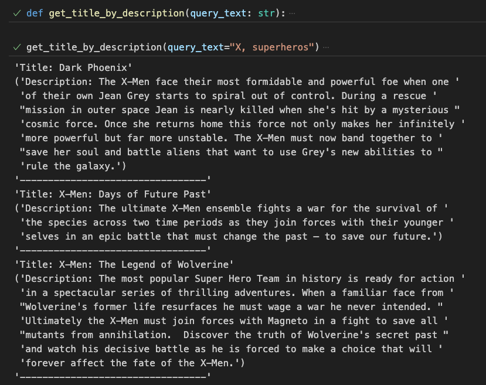

# Remind-Me-a-Movie

## Overview:

- Description: A project that leverages the rich Kaggle movie dataset and sentence transformers to help users find specific movies by describing the plot with keywords.
- Tech stack:
- Demo:
  

## Setup:

1. (For project isolation) create & activate a virtual environment (dependencies are installed within the virtual environment other than system-wide & all subsequent steps will be performed within the virtual environment):
   ```
   python -m venv .venv
   source .venv/bin/activate
   ```
2. Upgrade the pip package manager to the latest version within the current Python environment: `python -m pip install --upgrade pip`
3. Install Python dependencies listed in a `requirements.txt` file: `pip install -r requirements.txt`
4. (If necessary) Update the `requirements.txt` file: `pip freeze > requirements.txt`, so others can install all the packages and their respective versions specified in the requirements.txt file.

## Resources:

1. [Kaggle Datasets](https://www.kaggle.com/datasets)
2. [Chroma Docs](https://docs.trychroma.com/)
